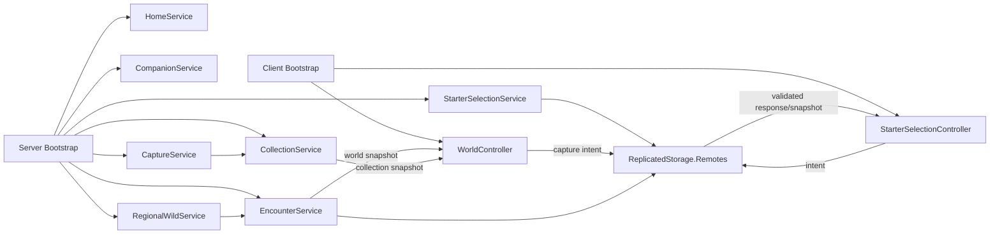

# Kiến trúc hiện tại của MythicCubes/VoxelCreatures

## Ranh giới và mapping

`default.project.json` map `src/ReplicatedStorage`, `src/ServerScriptService`, `src/ServerStorage`,
`src/StarterPlayer/StarterPlayerScripts` và `src/StarterGui` vào Roblox DataModel. Tên project trong
Rojo là `VoxelCreatures`.

Kiến trúc hiện tại quan sát được trong source checkout này gồm vertical slice session/harness của
Phase 1–3 và vertical slice world/capture của Phase 4. Phase 4 đã được xác minh ở mức source sau khi
reconcile branch; Roblox Studio acceptance vẫn đang chờ chạy/xác nhận và không được suy đoán từ code.

## Các tầng đang có

- `ReplicatedStorage.Shared`: types, definitions, registry, validators và pure combat/world utilities.
- `ServerScriptService.Server.Bootstrap.server.lua`: gọi Home, collection, companion, starter,
  regional wild, encounter và capture services.
- Server services Phase 1–3: `HomeService` tạo `HomePlaceholder`/spawn; `StarterSelectionService`
  sở hữu starter theo session, tạo remotes và gọi presentation; `CombatService` giữ combat harness
  regression theo player.
- Server services Phase 4: `CollectionService` giữ collection/inventory/team theo session;
  `CompanionService` tạo presentation và follow; `RegionalWildService` sở hữu spawn/despawn,
  identity, health, lifecycle và respawn; `EncounterService` sở hữu target, range, movement,
  damage và disengage; `CaptureService` validate request, tính kết quả và điều phối transaction;
  `RemoteFactory` tập trung tạo/kiểm tra remotes.
- Client bootstrap: `StarterSelectionController` hiển thị UI và gửi starter intent; sau selection,
  `WorldController` đọc snapshot, gửi capture intent và hiển thị kết quả server xác nhận. Client
  không gửi position, chance, damage, inventory hay ownership; `CombatController` cũ không chạy
  trong default Phase 4 runtime.
- `tests/unit`: test server-side cho data validation, combat harness và Phase 4 world/capture;
  `.project.json` riêng cho Phase 2/3/4 test mapping.

## Luồng runtime hiện tại

### Starter selection

Client gửi starter request; server dùng `StarterSelectionValidator`, kiểm tra một lần mỗi session,
rate-limit và gọi `StarterDisplayService`. State mapping là `Player → starterId`; không có DataStore.

### Combat harness

`CombatService` tạo state `Preparing → Active → Finished`, kiểm tra payload qua
`CombatRequestValidator`, kiểm tra ownership/target/skill/cooldown qua `CombatEngine`, tính damage bằng
pure shared utilities và gửi snapshot chỉ cho player sở hữu. Client không gửi damage, chance, health
hay kết quả thắng/thua. Phase 4 dùng cùng boundary server-authoritative cho encounter trên map.

### Phase 4 world/capture slice

`WorldDataRegistry` validate region/zone/capture-device definitions khi load. Source hiện có region
`verdant_meadow` với zone cá thể `meadow_single` và zone cụm `meadow_cluster`; range, tốc độ,
respawn, spawn pool và cluster size đều nằm trong definition. Hai capture device là
`trail_capsule` và `prism_snare`.

`RegionalWildService` tạo wild model blocky anchored và sở hữu state/health/return/respawn.
`EncounterService` đo khoảng cách server-side, chọn target, điều phối auto combat và kết thúc khi
owner/wild vượt boundary. `CaptureService` kiểm tra request ID, rate, device, inventory,
encounter/target/range và gọi `CollectionService` cho transaction idempotent. Đây là session-only
vertical slice; DataStore, progression, reward và production navigation chưa có.

## Dependency direction và ownership

`Client → Remotes → Server services → Shared pure/data modules` là hướng phụ thuộc chính. Shared không
đọc DataStore, không giữ player state và không phụ thuộc UI. Server giữ canonical player/combat state;
client chỉ giữ presentation/input state. Remote contract hiện có tại `RemoteNames` và các service tạo
remote cần thiết dưới `ReplicatedStorage.Remotes`.

## Current state, target state và giới hạn

Đã có: starter definitions/registry, server validation, session companion placeholder, combat snapshot
harness, Phase 4 world/capture services, test project và Studio test guides.

Chưa có hoặc chưa được acceptance trong checkout: progression, persistence, private home production,
formation ba companion, boss, reward economy, navigation/pathfinding production và production
presentation. Các phần mở rộng trong tài liệu thiết kế vẫn là product direction/DRAFT cho tới khi có
decision, story và evidence riêng.

Target gần nhất là chạy và ghi nhận Phase 4 Studio acceptance trước khi mở rộng architecture hoặc
viết story phase sau. Không tự migrate kiến trúc hoặc thêm service trong task quản lý tài liệu này.
