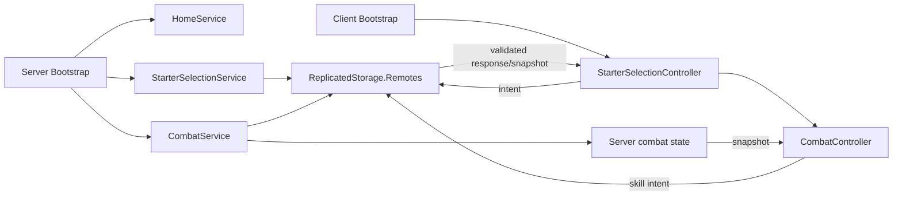

# Kiến trúc hiện tại của MythicCubes/VoxelCreatures

## Ranh giới và mapping

`default.project.json` map `src/ReplicatedStorage`, `src/ServerScriptService`, `src/ServerStorage`,
`src/StarterPlayer/StarterPlayerScripts` và `src/StarterGui` vào Roblox DataModel. Tên project trong
Rojo là `VoxelCreatures`.

Kiến trúc hiện tại quan sát được trong source checkout này là vertical slice session/harness của
Phase 1–3. Tài liệu cũ ghi Phase 4 đã có thêm world/capture services, nhưng các module đó không xuất
hiện trong tree source hiện tại; vì vậy Phase 4 được ghi `AWAITING_SOURCE_VERIFICATION`, không coi là
đã triển khai chỉ dựa trên tài liệu.

## Các tầng đang có

- `ReplicatedStorage.Shared`: types, definitions, registry, validators và pure combat utilities.
- `ServerScriptService.Server.Bootstrap.server.lua`: gọi `HomeService.start()`,
  `StarterSelectionService.start()` rồi `CombatService.start()`.
- Server services: `HomeService` tạo `HomePlaceholder`/spawn; `StarterSelectionService` sở hữu starter
  theo session và tạo remotes; `StarterDisplayService` tạo companion blocky đã xác nhận; `CombatService`
  sở hữu combat theo player, request rate/idempotency, basic attack và snapshot.
- Client bootstrap: `StarterSelectionController` hiển thị UI và gửi starter intent; sau selection,
  `CombatController` được khởi động và đọc snapshot/request skill.
- `tests/unit`: test server-side cho data validation và combat harness; `.project.json` riêng cho
  Phase 2/3 test mapping.

## Luồng runtime hiện tại

### Starter selection

Client gửi starter request; server dùng `StarterSelectionValidator`, kiểm tra một lần mỗi session,
rate-limit và gọi `StarterDisplayService`. State mapping là `Player → starterId`; không có DataStore.

### Combat harness

`CombatService` tạo state `Preparing → Active → Finished`, kiểm tra payload qua
`CombatRequestValidator`, kiểm tra ownership/target/skill/cooldown qua `CombatEngine`, tính damage bằng
pure shared utilities và gửi snapshot chỉ cho player sở hữu. Client không gửi damage, chance, health
hay kết quả thắng/thua.

## Dependency direction và ownership

`Client → Remotes → Server services → Shared pure/data modules` là hướng phụ thuộc chính. Shared không
đọc DataStore, không giữ player state và không phụ thuộc UI. Server giữ canonical player/combat state;
client chỉ giữ presentation/input state. Remote contract hiện có tại `RemoteNames` và các service tạo
remote cần thiết dưới `ReplicatedStorage.Remotes`.

## Current state, target state và giới hạn

Đã có: starter definitions/registry, server validation, session companion placeholder, combat snapshot
harness và Studio test guides lịch sử.

Chưa xác minh trong checkout: world spawn, open-world encounter, capture/collection, progression,
persistence, private home, formation, boss và production presentation. Các tài liệu thiết kế tương ứng
được xem là product direction/DRAFT cho tới khi có decision và story riêng.

Target gần nhất là xác minh baseline và khôi phục/định vị chính xác Phase 4 trước khi viết story code.
Không tự migrate kiến trúc hoặc thêm service trong task quản lý tài liệu này.
