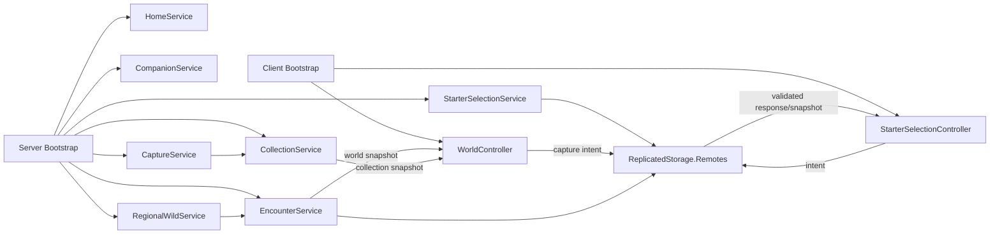

# Kiến trúc hiện tại của MythicCubes/VoxelCreatures

## Ranh giới và mapping

`default.project.json` map `src/ReplicatedStorage`, `src/ServerScriptService`, `src/ServerStorage`,
`src/StarterPlayer/StarterPlayerScripts` và `src/StarterGui` vào Roblox DataModel. Tên project trong
Rojo là `VoxelCreatures`.

Kiến trúc hiện tại quan sát được trong source checkout này gồm vertical slice session/harness của
Phase 1–3, vertical slice world/capture của Phase 4 và source implementation Phase 5 cho Village/
onboarding session. Automated/Play Solo/Server & Clients Phase 5, gồm camera Custom và physical
touch-gate Story 05-04, đã pass theo xác nhận người dùng ngày 2026-08-09; raw log/Studio version không
được cung cấp. Licensed audio/SFX vẫn pending nên giữ `SOURCE_VERIFIED_STUDIO_PENDING`.

## Các tầng đang có

- `ReplicatedStorage.Shared`: types, definitions, registry, validators và pure combat/world utilities.
- `ServerScriptService.Server.Bootstrap.server.lua`: gọi Home, collection, companion, starter,
  regional wild, encounter và capture services.
- Server services Phase 1–3: `HomeService` tạo `HomePlaceholder`/spawn; `StarterSelectionService`
  sở hữu starter theo session, tạo remotes và gọi presentation; `CombatService` giữ combat harness
  regression theo player.
- Server services Phase 4: `CollectionService` giữ collection/inventory/team theo session;
  `CompanionService` tạo presentation và follow; `RegionalWildService` sở hữu spawn/despawn,
  identity, health, lifecycle và respawn; `EncounterService` sở hữu target, range, movement,
  damage và disengage; `CaptureService` validate request, tính kết quả và điều phối transaction;
  `RemoteFactory` tập trung tạo/kiểm tra remotes.
- Server Phase 5: `VillageService` thay public `HomePlaceholder` trong default bootstrap, tạo Village,
  Normal tutorial route, năm gate và bốn elemental landing greybox; physical gate/return-gate touch được
  chuyển thành callback server với Player suy ra từ character. `OnboardingService` giữ state, resolve
  touch action, permission/debounce, exact remote contract, Tumblet transaction và per-player world access.
  `EncounterService` dùng Village safe zone; Encounter/Capture Phase 4 bị gate tới sau onboarding.
- Client bootstrap: `StarterSelectionController` hiển thị UI và gửi starter intent; sau selection,
  `OnboardingController` render server snapshot/input action/feedback nhưng giữ camera Roblox `Custom`;
  gate travel không phụ thuộc client button. Chỉ sau state
  `COMPLETE` mới khởi động `WorldController`. Client không gửi position, completion, chance, damage,
  inventory hay ownership; `CombatController` cũ không chạy trong default runtime.
- `tests/unit`: test server-side cho data validation, combat harness và Phase 4 world/capture;
  `.project.json` riêng cho Phase 2/3/4 test mapping.

## Luồng runtime hiện tại

### Starter selection

Client gửi starter request; server dùng `StarterSelectionValidator`, kiểm tra một lần mỗi session,
rate-limit và gọi `StarterDisplayService`. State mapping là `Player → starterId`; không có DataStore.

### Phase 5 onboarding

`OnboardingEngine` giữ flow một chiều `AWAITING_STARTER → NORMAL_WORLD_READY → NORMAL_TUTORIAL →
BASIC_ATTACK_PRACTICED → ACTIVE_SKILL_PRACTICED → TUMBLET_CAPTURED → WORLD_CHOICE_READY → COMPLETE`.
Starter commit là server-internal transition; các interaction còn lại validate exact payload, state,
server-measured range, rate và replay. Riêng world/return gate dùng server `BasePart.Touched`, pure
state/world resolution và per-player debounce; locked/wrong-state touch không teleport. Tutorial capture
dùng transaction collection hiện có để tiêu một
`trail_capsule` và grant Tumblet đúng một lần. Snapshot cuối chỉ mở Bình Nguyên Khởi Sinh cùng một
world nguyên tố do player chọn. Tất cả là session-only; rejoin reset, respawn giữ state/location.

### Combat harness

`CombatService` tạo state `Preparing → Active → Finished`, kiểm tra payload qua
`CombatRequestValidator`, kiểm tra ownership/target/skill/cooldown qua `CombatEngine`, tính damage bằng
pure shared utilities và gửi snapshot chỉ cho player sở hữu. Client không gửi damage, chance, health
hay kết quả thắng/thua. Phase 4 dùng cùng boundary server-authoritative cho encounter trên map.

### Phase 4 world/capture slice

`WorldDataRegistry` validate region/zone/capture-device definitions khi load. Source hiện có region
`verdant_meadow` với zone cá thể `meadow_single` và zone cụm `meadow_cluster`; range, tốc độ,
respawn, spawn pool và cluster size đều nằm trong definition. Bốn capture device theo thứ tự tier là
`trail_capsule`, `prism_snare`, `violet_orb` và `crimson_orb`; `crimson_orb` là special.

`RegionalWildService` tạo wild model blocky anchored, gán `spawnGroupId` và sở hữu
state/health/return/respawn. `EncounterService` đo khoảng cách server-side, cho nhiều player
participant cùng một encounter, claim nhiều wild cùng spawn group, chọn target, điều phối auto combat
và gỡ participant khi vượt boundary. `CaptureService` kiểm tra request ID/fingerprint, rate, device,
inventory, encounter/target/range, capture lock và gọi `CollectionService` cho transaction
idempotent. Đây là session-only vertical slice; DataStore, progression, reward và production
navigation chưa có.

## Dependency direction và ownership

`Client → Remotes → Server services → Shared pure/data modules` là hướng phụ thuộc chính. Shared không
đọc DataStore, không giữ player state và không phụ thuộc UI. Server giữ canonical player/combat state;
client chỉ giữ presentation/input state. Remote contract hiện có tại `RemoteNames` và các service tạo
remote cần thiết dưới `ReplicatedStorage.Remotes`.

## Current state, target state và giới hạn

Đã có trong source: năm starter và Tumblet data-driven, server validation, session companion,
combat/world/capture Phase 4, Village/onboarding Phase 5, test project và Studio matrix.

Automated, Play Solo, touch/gamepad, Server & Clients, exploit matrix và camera/readability/performance
đã pass theo xác nhận người dùng ngày 2026-08-09, gồm camera Custom và physical touch-gate. Raw log và
Studio version không được cung cấp; licensed audio/SFX vẫn pending nên Phase chưa `DONE`.

Chưa có hoặc chưa được acceptance trong checkout: progression, persistence, private home production,
formation ba companion, boss, reward economy, navigation/pathfinding production và production
presentation. Các phần mở rộng trong tài liệu thiết kế vẫn là product direction/DRAFT cho tới khi có
decision, story và evidence riêng.

Phase 4 logic cũ đã đóng; các thay đổi hit/miss, manual aim hoặc presentation nếu được chấp nhận phải
được lập story/phase tương lai riêng. Roadmap hiện dành Phase 11.5 cho contact/control mechanics và
Phase 12 cho presentation; cả hai chưa có implementation trong checkout. Không tự migrate kiến trúc
hoặc thêm service trong task quản lý tài liệu này.
